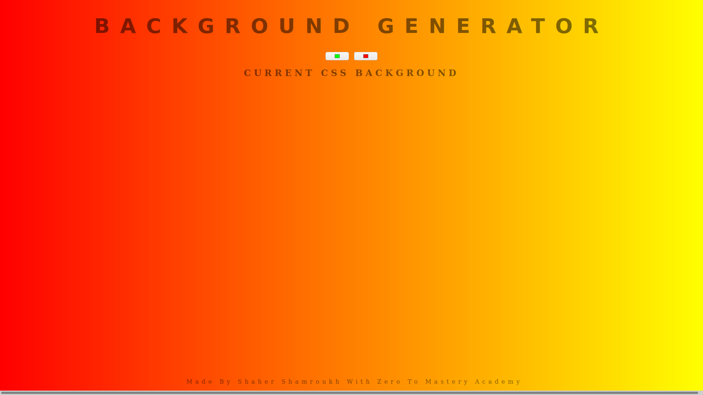

# Gradient generator
> Gradient color generator a website to generate gradient colors with a few clicks and choose whichever color looks appealing.



Additional description about the project and its features.

## Built With

- HTML
- CSS
- Javascript

## Live Demo

[Live Demo Link](https://gradientbackgrnd.netlify.app/)


## Getting Started

**Clone the repo by running ```git clone``` https://github.com/Shaher-11/gradient-color-generator.git**
**open the html file with any browser**


## Author

👤 **Shaher**

- Twitter: [@twitterhandle](https://twitter.com/ShaherShamroukh/)
- LinkedIn: [LinkedIn](https://www.linkedin.com/in/shaher-shamroukh/)
- GitHub: [@githubhandle](https://github.com/Shaher-11/)


## 🤝 Contributing

Contributions, issues, and feature requests are welcome!

Feel free to check the [issues page](issues/).

## Show your support

Give a ⭐️ if you like this project!

## Acknowledgments

- ZTM Academy

## 📝 License

This project is [MIT](lic.url) licensed.
